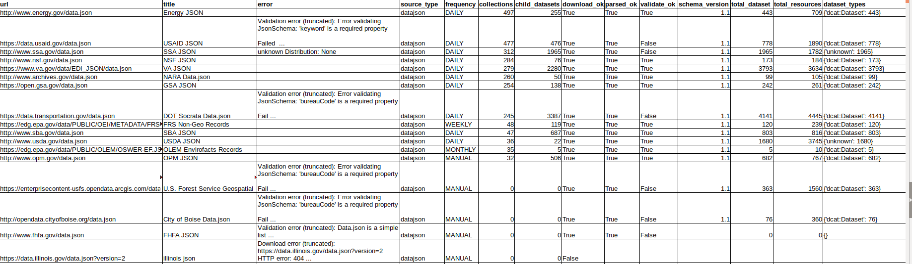

# Harvesting 

This project is about harvesting from external sources to a CKAN (local or remote) instance.  
This project uses a custom Python library ([ckan-harvesters](https://pypi.org/project/ckan-harvesters/))in order to read and validate different types of data sources.  

## data.json files

[More info](harvester_ng/datajson/README.md)

## CSW

[More info](harvester_ng/csw/README.md)

## Harvest sources

The _data.json_, _csw_ or other harvest sources are CKAN packages with an URL to the some resource.  
We can import all the harvest sources from a productive CKAN instance with the command `import_harvest_sources`.  

For example import all CSW harvest sources from _data.gov_.  
```
cd tools

# for example import all CSW harvest sources from data.gov
python import_harvest_sources.py \
    --import_from_url https://catalog.data.gov \
    --source_type csw \
    --method GET \
    --destination_url http://nginx:8080 \
    --destination_api_key d0ff7be9-4edf-41e8-87a8-ff80fb6b5dbc \
    --method GET

Getting external harvest sources for https://catalog.data.gov
Searching https://catalog.data.gov/api/3/action/package_search PAGE:1 start:0, rows:1000 with params: {'start': 0, 'rows': 1000, 'fq': '+dataset_type:harvest', 'q': '(type:harvest source_type:csw)'}
Search harvest packages via GET
6 results
**** Importing Organization {'description': 'The Arctic Landscape  ...
**** Creating Organization 
POST http://nginx:8080/api/3/action/package_create data:{'frequency': 'MANUAL', 'title': 'Alaska LCC CSW Server', 'name': 'alaska-lcc-csw-server', 'type': 'harvest', 'source_type': 'csw', 'url': 'http://metadata.arcticlcc.org/csw', 'notes': 'The CSW server for [Alaska-based Landscape Conservation Cooperatives](http://climate.arcticlcc.org/).', 'owner_org': 'alcc-fws-gov', 'private': False, 'state': 'active', 'active': True, 'tags': [{'name': 'harvest source'}], 'config': None, 'extras': []}

...

----------------------------------------------
Finished: 6 sources
----------------------------------------------

```
This also import and create _organizations_.  

### Some tools

#### Read harvest sources
You can search via CKAN API the list of packages/harvest sources. 

Get CSW harvest sources at _data.gov_
```
cd tools

python read_harvest_sources.py --base_url=http://nginx:8080

python read_harvest_sources.py --base_url https://catalog.data.gov --source_type csw --method GET  
# CKAN 2.3 fail with POST, current versions works fine with POST

Searching https://catalog.data.gov/api/3/action/package_search PAGE:1 start:0, rows:1000 with params: {'start': 0, 'rows': 1000, 'fq': '+dataset_type:harvest', 'q': '(type:harvest source_type:csw)'}
6 results
Harvest source: Alaska LCC CSW Server 54778007-bac5-4f2e-8015-622176f23e02 
	alaska-lcc-csw-server csw http://metadata.arcticlcc.org/csw
	{'description': 'The Arctic Landscape Conservation Cooperative (ALCC) supports conservation in the arctic by providing [applied science](http://arcticlcc.org/projects/) and [tools](http://arcticlcc.org/products/) to land managers and policy makers. It is a self-directed partnership that functions through a structure of at-large partners, a core staff, and a steering committee of cooperating agencies and organizations. Its [geographic scope](http://arcticlcc.org/projects/geospatial-data/arctic-lcc-boundaries/) ranges across North America from Alaska to Labrador. The Alaska portion encompasses three eco-regions: the Brooks Range, the Arctic Foothills, and the Arctic Coastal Plain.', 'created': '2013-08-30T12:57:14.187258', 'title': 'Arctic Landscape Conservation Cooperative', 'name': 'alcc-fws-gov', 'is_organization': True, 'state': 'active', 'image_url': 'http://arcticlcc.org/assets/images/logos/logo_small.png', 'revision_id': 'ecafc1e0-403b-488e-bca1-62b78e4abc81', 'type': 'organization', 'id': 'fe75ed93-9c93-4c56-bc02-11ab228d1abd', 'approval_status': 'approved'}
Harvest source: NC OneMap CSW f6462f24-5acc-4eaf-937e-f8341585087c 
	nc-onemap-csw csw http://data.nconemap.com/geoportal/csw?Request=GetCapabilities&Service=CSW&Version=2.0.2
	{'description': '', 'created': '2013-03-14T03:44:38.764842', 'title': 'State of North Carolina', 'name': 'nc-gov', 'is_organization': True, 'state': 'active', 'image_url': 'http://www.nconemap.com/portals/7/images/gpt_logo_small.png', 'revision_id': '4fb5830b-68c1-4e8b-a04e-3750c3e885c8', 'type': 'organization', 'id': '1abdfb5f-4371-4fa3-8ef3-497cebe1b3fe', 'approval_status': 'approved'}

  ...
```

Get your local data.json harvest sources
```
python3 read_harvest_sources.py --base_url http://ckan:5000 --source_type datajson --method POST
```

#### Analyze 

Creates a CSV file with all the harvest sources. Analyze each one to validate it, count datastets and resources.

```
python tools/analyze_harvest_sources.py 

Searching https://catalog.data.gov/api/3/action/package_search PAGE:1 start:0, rows:1000 with params: {'start': 0, 'rows': 1000, 'fq': '+dataset_type:harvest', 'q': '(type:harvest)'}
977 results
data/harvest_sources/datasets/harvest-source-census-5-digit-zip-code-tabulation-area-zcta5-national.json saved
 +++ [[waf-collection]] Reading source Census 5-Digit ZIP Code Tabulation Area (ZCTA5) National (1) from http://meta.geo.census.gov/data/existing/decennial/GEO/GPMB/TIGERline/TIGER2013/zcta510/
data/harvest_sources/datasets/harvest-source-current-american-indian-alaska-native-native-hawaiian-areas-national-aiannh.json saved
 +++ [[waf-collection]] Reading source Current American Indian/Alaska Native/Native  Hawaiian Areas National (AIANNH) (2) from http://meta.geo.census.gov/data/existing/decennial/GEO/GPMB/TIGERline/TIGER2013/aiannh/
+++ [[datajson]] Reading source WPRDC data.json (255) from https://data.wprdc.org/data.json
 +++++++++++ ERROR
Validation error (truncated): Error validating JsonSchema: 'bureauCode' is a required property

 ... 

```

CSV results




## Harvest ALL sources

We create a script](https://gitlab.com/datopian/ckan-ng-harvest/blob/develop/automate-tasks/airflow/dags/harvest_with_airflow.py) to put ALL the harvest sources in a queue using [Airflow](https://gitlab.com/datopian/ckan-ng-harvest/blob/develop/automate-tasks/airflow/README.md).  


## Generate harvest commands list

If you want to check or analize the harvest commands you can run the script `generate_commands_list.py`.  

```
cd tools
python generate_commands_list.py \
  --ckan_url http://nginx:8080 \
  --ckan_api_key xxxxxxxxxxxxx \
  --source_type datajson
```
This script will list all the valid commands to harvest each source.

### Tests

Check the [tests.md](tests/tests.md) file.  

### Logs

Notes about logging at [logging.md](docs/logging.md) file.  

### Docker usage

Use harvester with docker. More info [here](docker.md).  

### Security scanning

Merge requests are scanned using `safety` to detect known vulnerabilities in
dependencies and with `bandit` to find security issues in the code via static
analysis.

### Dependency management

Required dependencies are installed using pip.  Pinned production requirements are found 
in `requirements.txt`, development requirements in `dev-requirements.txt`.

These files are generated using `pip-compile` (from `pip-tools`) from `requirements.in`
and `dev-requirements.in`, respectively.

To update the pinned requirement files, install `pip-tools` and run:

```
$ pip-compile requirements.in
$ pip-compile dev-requirements.in
```

