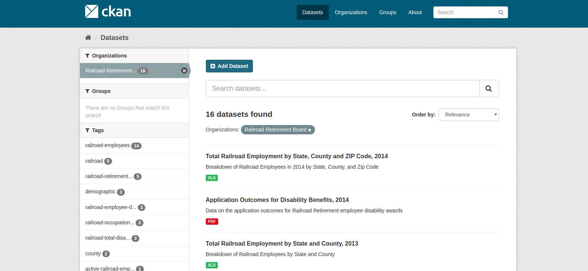
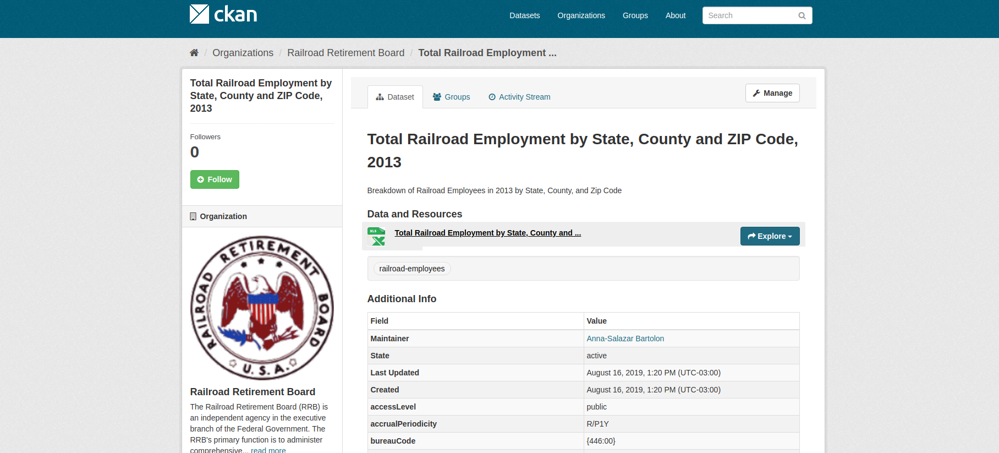

# Harvesting 

## data.json files

[More info](harvest/datajson/README.md)

## CSW

[More info](harvest/csw/README.md)

## Settings

The files _settings.py_ (empty) and _local_settings.py_ (ignored from repo) are to define your local configuration (url, api key, etc).  

## Harvest sources

The _data.json_, _csw_ or other harvest sources are CKAN packages with an URL to this file.  
We can import all the harvest sources from a productive CKAN instance with the command

### Some tools

#### Read harvest sources
You can search via CKAN API the list of packages/harvest sources. 

Get CSW harvest sources at _data.gov_
```
python3 read_harvest_sources.py --base_url https://catalog.data.gov --source_type csw --method GET  
# CKAN 2.3 fail with POST, current versions works fine with POST

Searching https://catalog.data.gov/api/3/action/package_search PAGE:1 start:0, rows:1000 with params: {'start': 0, 'rows': 1000, 'fq': '+dataset_type:harvest', 'q': '(type:harvest source_type:csw)'}
6 results
Harvest source: Alaska LCC CSW Server 54778007-bac5-4f2e-8015-622176f23e02 
	alaska-lcc-csw-server csw http://metadata.arcticlcc.org/csw
	{'description': 'The Arctic Landscape Conservation Cooperative (ALCC) supports conservation in the arctic by providing [applied science](http://arcticlcc.org/projects/) and [tools](http://arcticlcc.org/products/) to land managers and policy makers. It is a self-directed partnership that functions through a structure of at-large partners, a core staff, and a steering committee of cooperating agencies and organizations. Its [geographic scope](http://arcticlcc.org/projects/geospatial-data/arctic-lcc-boundaries/) ranges across North America from Alaska to Labrador. The Alaska portion encompasses three eco-regions: the Brooks Range, the Arctic Foothills, and the Arctic Coastal Plain.', 'created': '2013-08-30T12:57:14.187258', 'title': 'Arctic Landscape Conservation Cooperative', 'name': 'alcc-fws-gov', 'is_organization': True, 'state': 'active', 'image_url': 'http://arcticlcc.org/assets/images/logos/logo_small.png', 'revision_id': 'ecafc1e0-403b-488e-bca1-62b78e4abc81', 'type': 'organization', 'id': 'fe75ed93-9c93-4c56-bc02-11ab228d1abd', 'approval_status': 'approved'}
Harvest source: NC OneMap CSW f6462f24-5acc-4eaf-937e-f8341585087c 
	nc-onemap-csw csw http://data.nconemap.com/geoportal/csw?Request=GetCapabilities&Service=CSW&Version=2.0.2
	{'description': '', 'created': '2013-03-14T03:44:38.764842', 'title': 'State of North Carolina', 'name': 'nc-gov', 'is_organization': True, 'state': 'active', 'image_url': 'http://www.nconemap.com/portals/7/images/gpt_logo_small.png', 'revision_id': '4fb5830b-68c1-4e8b-a04e-3750c3e885c8', 'type': 'organization', 'id': '1abdfb5f-4371-4fa3-8ef3-497cebe1b3fe', 'approval_status': 'approved'}

  ...
```

Get your local data.json harvest sources
```
python3 read_harvest_sources.py --base_url http://ckan:5000 --source_type datajson --method POST
```

#### Import harvest sources

You can import harvest sources from another CKAN instance.
For example import all CSW harvest sources from data.gov
```
python3 import_harvest_sources.py --import_from_url https://catalog.data.gov --source_type csw --method GET
```
This also import and create _organizations_.  

#### Analyze 

Creates a CSV file with all the harvest sources. Analyze each one to validate it, count datastets and resources.

```
python3 analize_harvest_sources.py 

Searching https://catalog.data.gov/api/3/action/package_search PAGE:1 start:0, rows:1000 with params: {'start': 0, 'rows': 1000, 'fq': '+dataset_type:harvest', 'q': '(type:harvest)'}
977 results
data/harvest_sources/datasets/harvest-source-census-5-digit-zip-code-tabulation-area-zcta5-national.json saved
 +++ [[waf-collection]] Reading source Census 5-Digit ZIP Code Tabulation Area (ZCTA5) National (1) from http://meta.geo.census.gov/data/existing/decennial/GEO/GPMB/TIGERline/TIGER2013/zcta510/
data/harvest_sources/datasets/harvest-source-current-american-indian-alaska-native-native-hawaiian-areas-national-aiannh.json saved
 +++ [[waf-collection]] Reading source Current American Indian/Alaska Native/Native  Hawaiian Areas National (AIANNH) (2) from http://meta.geo.census.gov/data/existing/decennial/GEO/GPMB/TIGERline/TIGER2013/aiannh/
+++ [[datajson]] Reading source WPRDC data.json (255) from https://data.wprdc.org/data.json
 +++++++++++ ERROR
Validation error (truncated): Error validating JsonSchema: 'bureauCode' is a required property

 ... 

```

CSV results


### Harvest one source

We have one folder for each harvester.  
For data.json we have _harvest/datajson_, for csw: _harvest/csw_.  
En each folder you can read specs about each process.  

In general you will need:
 - a _name_ for the harvest source
 - url of the data.json
 - harvest_source_id: the ID of the harvest source
 - ckan_owner_org_id: name of the organization for all the harvested datasets
 - catalog_url you CKAN instance 
 - ckan_api_key you CKAN API key

Example using data from _read_harvest_sources_ and a local CKAN instance

```
cd harvest/datajson
python3 harvest.py \
  --name rrb \
  --url https://secure.rrb.gov/data.json \
  --harvest_source_id e058dafa-75db-4480-a90a-c1026e3005e2 \
  --ckan_owner_org_id rrb-gov \
  --catalog_url http://ckan:5000 \
  --ckan_api_key 5ce77b38-3556-4a2c-9e44-5a18f53f9862
```

Results

```
**************
Execute: python3 flow.py --name rrb --url https://secure.rrb.gov/data.json --limit_dataset 0
**************
Geting data.json from https://secure.rrb.gov/data.json
/home/hudson/envs/data_json_etl/lib/python3.6/site-packages/urllib3/connectionpool.py:851: InsecureRequestWarning: Unverified HTTPS request is being made. Adding certificate verification is strongly advised. See: https://urllib3.readthedocs.io/en/latest/advanced-usage.html#ssl-warnings
  InsecureRequestWarning)
Downloaded OK
JSON OK
Validate OK: 16 datasets
VALID JSON, 16 datasets found
Cleaning duplicates
0 duplicates deleted. 16 OK
Continue to next step with: python3 flow2.py --name rrb 
**************
COMD OK: python3 flow.py --name rrb --url https://secure.rrb.gov/data.json --limit_dataset 0
**************
**************
Execute: python3 flow2.py --name rrb --harvest_source_id e058dafa-75db-4480-a90a-c1026e3005e2 --catalog_url http://ckan:5000
**************
Extracting from harvest source id: e058dafa-75db-4480-a90a-c1026e3005e2
Searching http://ckan:5000/api/3/action/package_search PAGE:1 start:0, rows:1000 with params: {'start': 0, 'rows': 1000, 'fq': '+harvest_ng_source_id:"e058dafa-75db-4480-a90a-c1026e3005e2"'}
0 results
0 total resources in harvest source id: e058dafa-75db-4480-a90a-c1026e3005e2
Rows from resource ckan_results
Total processed: 0.
                0 fail extras.
                0 fail identifier key.
                0 deleted.
                0 datasets found (0 needs update, 0 are the same),
                16 new datasets.
Continue to next step with: python3 flow3.py --name rrb --harvest_source_id e058dafa-75db-4480-a90a-c1026e3005e2
**************
COMD OK: python3 flow2.py --name rrb --harvest_source_id e058dafa-75db-4480-a90a-c1026e3005e2 --catalog_url http://ckan:5000
**************
**************
Execute: python3 flow3.py --name rrb --ckan_owner_org_id rrb-gov --catalog_url http://ckan:5000 --ckan_api_key 5ce77b38-3556-4a2c-9e44-5a18f53f9862
**************
Transforming data.json dataset RRB-460
Dataset transformed RRB-460 OK
POST http://ckan:5000/api/3/action/package_create headers:{'User-Agent': 'ckan-portal-filter 0.01-alpha', 'X-CKAN-API-Key': '5ce77b38-3556-4a2c-9e44-5a18f53f9862', 'Content-Type': 'application/json'} data:{'name': 'total-railroad-employment-by-state-and-county-2014', 'title': 'Total Railroad Employment by State and County, 2014', 'owner_org': 'rrb-gov', 'private': False, 'maintainer': 'Anna Salazar-Bartolon', 'maintainer_email': 'Anna.Salazar-Bartolon@rrb.gov', 'notes': 'A breakdown of Railroad employees by State and County', 'state': 'active', 'resources': [{'url': 'http://www.rrb.gov/sites/default/files/2017-01/StateCounty2014.xls', 'description': 'A breakdown of Railroad employees by State and County', 'format': 'application/xls', 'name': 'Total Railroad Employment by State and County, 2014', 'mimetype': 'application/vnd.ms-excel', 'describedBy': 'https://www.rrb.gov/FinancialReporting/FinancialActuarialStatistical/Annual'}], 'tags': [{'name': 'county'}, {'name': 'demographic'}, {'name': 'railroad'}, {'name': 'railroad-employees'}], 'extras': [{'key': 'resource-type', 'value': 'Dataset'}, {'key': 'modified', 'value': '2016-03-01'}, {'key': 'identifier', 'value': 'RRB-460'}, {'key': 'accessLevel', 'value': 'public'}, {'key': 'bureauCode', 'value': ['446:00']}, {'key': 'programCode', 'value': ['000:000']}, {'key': 'spatial', 'value': 'US'}, {'key': 'accrualPeriodicity', 'value': 'R/P1Y'}, {'key': 'landingPage', 'value': 'http://www.rrb.gov/pdf/act/StateCounty2014.xls'}, {'key': 'issued', 'value': '2016-03-01'}, {'key': 'harvest_source_title', 'value': 'rrb'}, {'key': 'source_schema_version', 'value': '1.1'}, {'key': 'source_hash', 'value': '10f8d1f8f7d01a2defc4eea7d31c304e49a5b905'}, {'key': 'catalog_@context', 'value': 'https://project-open-data.cio.gov/v1.1/schema/catalog.jsonld'}, {'key': 'catalog_conformsTo', 'value': 'https://project-open-data.cio.gov/v1.1/schema'}, {'key': 'catalog_describedBy', 'value': 'https://project-open-data.cio.gov/v1.1/schema/catalog.json'}, {'key': 'source_datajson_identifier', 'value': True}, {'key': 'publisher', 'value': 'Railroad Retirement Board'}]}
Transforming data.json dataset RRB-501
Dataset transformed RRB-501 OK
POST http://ckan:5000/api/3/action/package_create headers:{'User-Agent': 'ckan-portal-filter 0.01-alpha', 'X-CKAN-API-Key': '5ce77b38-3556-4a2c-9e44-5a18f53f9862', 'Content-Type': 'application/json'} data:{'name': 'application-outcomes-for-disability-benefits-2015', 'title': 'Application Outcomes for Disability Benefits, 2015', 'owner_org': 'rrb-gov', 'private': False, 'maintainer': 'Anna Salazar-Bartolon', 'maintainer_email': 'Anna.Salazar-Bartolon@rrb.gov', 'notes': 'Data on the application outcomes for Railroad Retirement employee and survivor disability awards', 'state': 'active', 'resources': [{'url': 'https://www.rrb.gov/sites/default/files/2017-06/Application%20Outcomes%20for%20Disability%20Benefits%20Report%20Final%202017-02.pdf', 'description': 'Data on the application outcomes for Railroad Retirement employee and survivor disability awards', 'format': 'pdf', 'name': 'Application Outcomes for Disability Benefits for Employees and Survivors, 2015', 'mimetype': 'application/pdf', 'describedBy': 'https://www.rrb.gov/sites/default/files/2016-10/TotalEmployment2014.pdf'}], 'tags': [{'name': 'railroad-employee-disability'}, {'name': 'railroad-employees'}, {'name': 'railroad-occupational-disability'}, {'name': 'railroad-survivor-disability'}, {'name': 'railroad-total-disability'}], 'extras': [{'key': 'resource-type', 'value': 'Dataset'}, {'key': 'modified', 'value': '2017-02-28'}, {'key': 'identifier', 'value': 'RRB-501'}, {'key': 'accessLevel', 'value': 'public'}, {'key': 'bureauCode', 'value': ['446:00']}, {'key': 'programCode', 'value': ['000:000']}, {'key': 'spatial', 'value': 'Global'}, {'key': 'accrualPeriodicity', 'value': 'R/P1Y'}, {'key': 'landingPage', 'value': 'https://www.rrb.gov/FinancialReporting/FinancialActuarialStatistical/Annual'}, {'key': 'issued', 'value': '2017-02-28'}, {'key': 'harvest_source_title', 'value': 'rrb'}, {'key': 'source_schema_version', 'value': '1.1'}, {'key': 'source_hash', 'value': '9e63b0ddfef1ba8a9dc87a048f0ed4edda8bedae'}, {'key': 'catalog_@context', 'value': 'https://project-open-data.cio.gov/v1.1/schema/catalog.jsonld'}, {'key': 'catalog_conformsTo', 'value': 'https://project-open-data.cio.gov/v1.1/schema'}, {'key': 'catalog_describedBy', 'value': 'https://project-open-data.cio.gov/v1.1/schema/catalog.json'}, {'key': 'source_datajson_identifier', 'value': True}, {'key': 'publisher', 'value': 'Railroad Retirement Board'}]}

...
....

**************
COMD OK: python3 flow3.py --name rrb --ckan_owner_org_id rrb-gov --catalog_url http://ckan:5000 --ckan_api_key 5ce77b38-3556-4a2c-9e44-5a18f53f9862
**************
```

You can see the harvested datasets at you CKAN instance




## Harvest ALL sources

We create [a script](https://gitlab.com/datopian/ckan-ng-harvest/blob/develop/automate-tasks/airflow/harvest_with_airflow.py) to put ALL the harvest sources in a queue using [Airflow](https://gitlab.com/datopian/ckan-ng-harvest/blob/develop/automate-tasks/airflow/README.md).  


## Generate harvest commands list

If you want to check the com

### Tests

Check the [tests.md](tests.md) file.  


