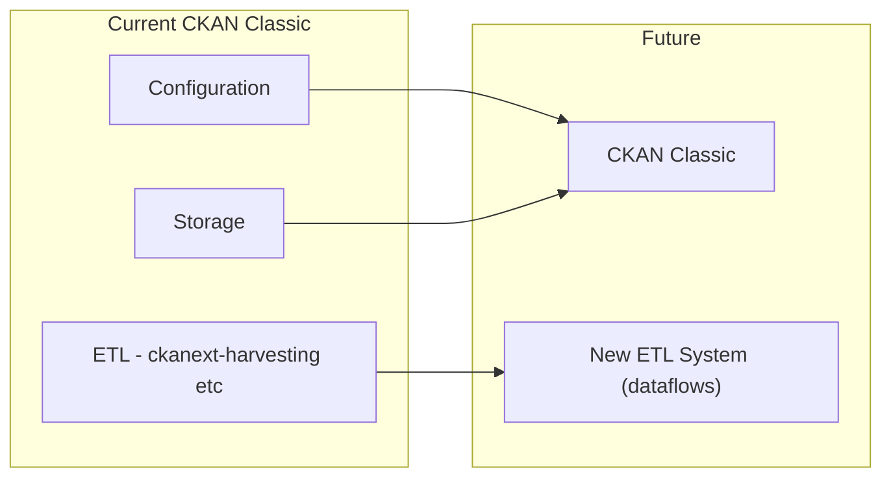
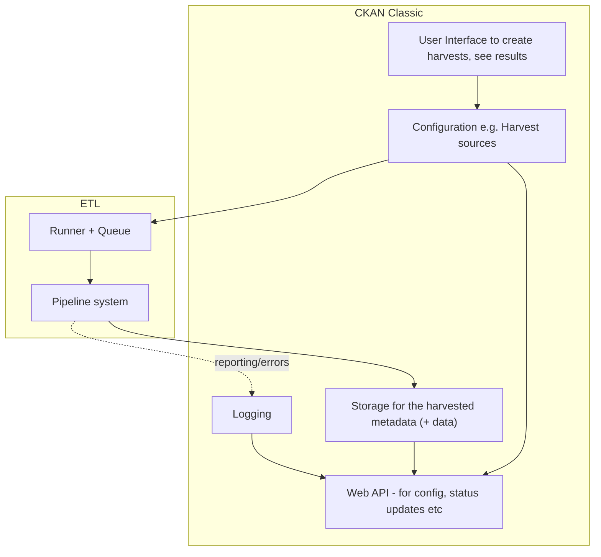
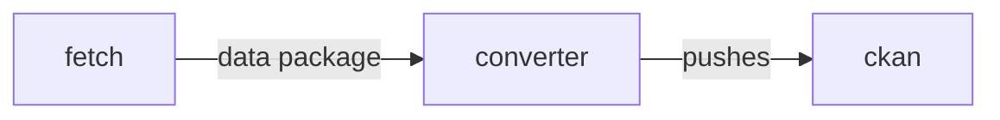
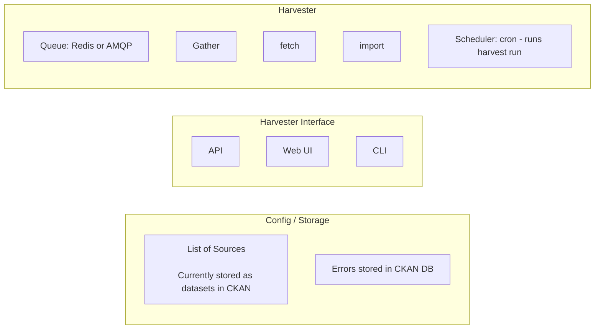
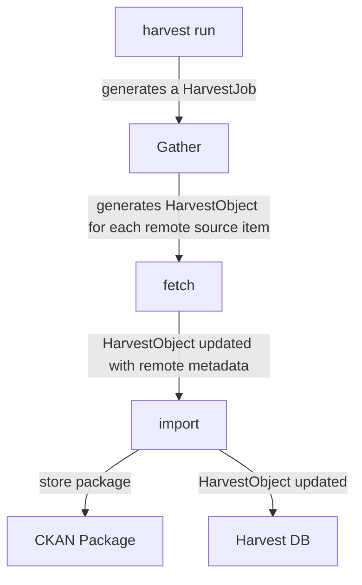
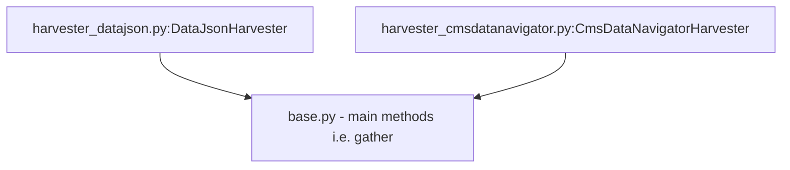
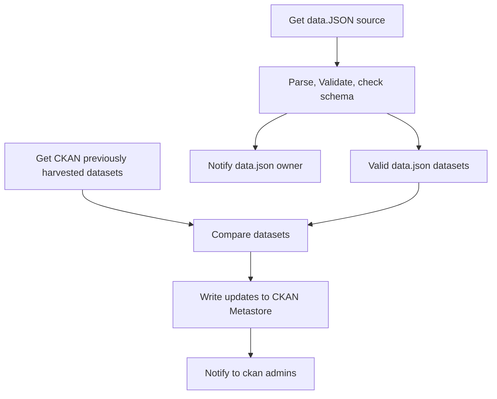
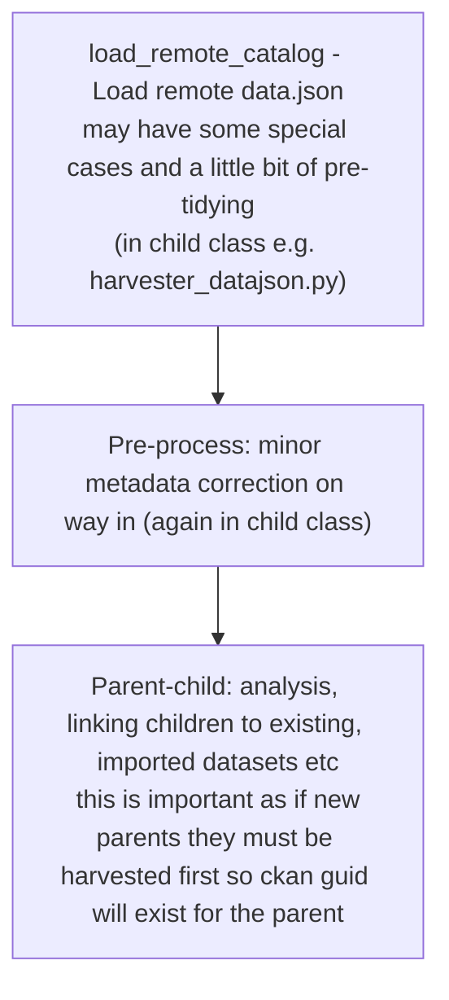
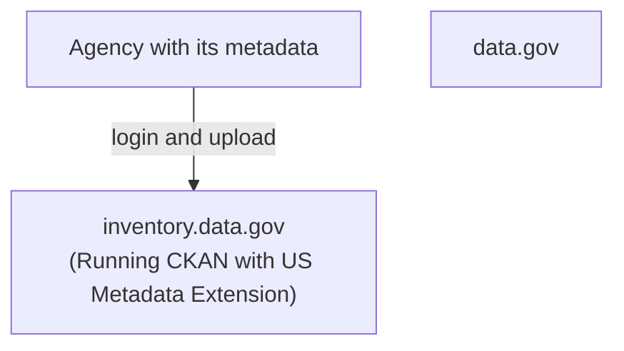

# data.gov Harvesting - July 2019

> TODO:
> 
> * tidy this up (? e.g. headings levels)
> * a lot of the CKAN / NG stuff is moving to tech.datopian.com (probably factor that out? though may be useful having all as it was originally)

This document sets out an approach to next gen harvesting for CKAN with a particular focus on data.gov.  The core epic for this feature is:

> As X I want to harvest datasets' metadata (and maybe data) into one CKAN instance from other catalogs so that all the metadata is in one place (and hence searchable there)

**Table of Contents**

[[toc]]

# FAQs

## What is harvesting?

Collect metadata (and maybe data) located in another sources and put into a CKAN instance (gather, fetch and import).
 
## How does CKAN currently do harvesting?

We use [ckanext-harvest](https://github.com/ckan/ckanext-harvest). This is how it works (hackmd): Gather, fetch and import from a harvest source (e.g. CSW or CKAN) through a harvest job.
 
## How are data.gov using harvesting (how much, for what, etc)?

Policy requirements for gov agencies to list their data. Data.gov need to harvest all that data.
 
They use data.json harvester if it exists (the source has a data.json resource) and they have a CSW Harvester. Through a CKAN API they put the data in the open data portal.
 
There is an additional workflow for geospatial providers. GSA has many harvesters depending on the data. 


## How do we want to do harvesting in the future?
If we continue using ckanext-harvest extension first we need to update the extension (e.g. has [pending and old PRs](https://github.com/ckan/ckanext-harvest/pulls)).

We can do research on ETL and scraping frameworks. Maybe we need to move ETL process outside CKAN.

## What's a _Data Package_?
A [Data Package](https://frictionlessdata.io/data-packages/) is a simple container format used to describe and package a collection of data. The format provides a simple contract for data interoperability that supports frictionless delivery, installation and management of data.


# Proposal

First, "harvesting" of metadata in its essence is exactly the same as any data collection and transformation process ("ETL"). "metadata" is no different from any other data for our purposes (it is just quite small!).

This insight allows us to see harvesting as just like any other ETL process. At the same time, the specific nature of *this* ETL process e.g. that it is about collecting dataset metadata, allows us to design the system in specific ways.

The essence of the NG proposal is the decoupling of the actual harvesting from the harvesting config/storage.

## Harvesting Systems

A harvesting system consists of the following key components:

* **Configuration** e.g. of harvest sources (+ UI and API)
* **ETL** to do the harvesting of the metadata (This includes an API for reporting and runnings)
* **Storage** for the harvested metadata

## CKAN NG Harvesting

* Keep storage and config in CKAN Classic
* New ETL system for the actual harvesting process



Dataflows - https://github.com/datahq/dataflows


### More detail (in progress)




ETL process (may not even need these stages separated)



* All "fetchers" produce data packages 


# CKAN Harvesting

https://github.com/ckan/ckanext-harvest

README is excellent and def worth reading - key parts of that are also below.


## Critique 

The main critique is that we are building a full mini-ETL system into CKAN.

Good:

* Using CKAN as metadata (config) store and having a UI for that

Not so good:

* An ETL system integrated with CKAN
  * Tightly coupled: so running tests of ETL requires CKAN (??)
  * Installation is painful (CKAN + 6 steps)
  * Dependent on CKAN upgrade cycles (tied via code rather than service API)
  * CKAN is more complex
* Rigid structure (gather, fetch, import) which may not fit many situations e.g. data.json harvesting (one big file with many datasets where everything done in gather) or where dependencies between stages
* Maintenance Status - Some maintenance but not super it looks like but quite a lot outstanding ... 
  * 47 [open issues](https://github.com/ckan/ckanext-harvest/issues)
  * 6 [open pull requests](https://github.com/ckan/ckanext-harvest/pulls) (some over a year old)


## Analysis - How it works

Domain model - [Here](https://github.com/ckan/ckanext-harvest/blob/master/ckanext/harvest/model/__init__.py)

* HarvestSource - a remote source for harvesting datasets from e.g. a CSW server or CKAN instance 
* HarvestJob - a job to do the harvesting (done in 2 stages: gather and then fetch and import). This is basically state for the overall process of doing a harvest.
* HarvestObject - job to harvest one dataset. Also holds dataset on the remote instance (id / url)
* HarvestGatherError
* HarvestObjectError
* HarvestLog



0. *Harvest run:* a regular run of the Harvester that generates a HarvestJob object. This is then passed to gather stage. This is what is generated by cron `harvest run` execution (or from web UI)
1.  The **gather** stage compiles all the resource identifiers that need to be fetched in the next stage (e.g. in a CSW server, it will perform a GetRecords operation).
2.  The **fetch** stage gets the contents of the remote objects and stores them in the database (e.g. in a CSW server, it will perform an GetRecordById operations).
3.  The **import** stage performs any necessary actions on the fetched resource (generally creating a CKAN package, but it can be anything the extension needs).



```python
def gather_stage(self, harvest_job):
    '''
    The gather stage will receive a HarvestJob object and will be
    responsible for:
        - gathering all the necessary objects to fetch on a later.
          stage (e.g. for a CSW server, perform a GetRecords request)
        - creating the necessary HarvestObjects in the database, specifying
          the guid and a reference to its job. The HarvestObjects need a
          reference date with the last modified date for the resource, this
          may need to be set in a different stage depending on the type of
          source.
        - creating and storing any suitable HarvestGatherErrors that may
          occur.
        - returning a list with all the ids of the created HarvestObjects.
        - to abort the harvest, create a HarvestGatherError and raise an
          exception. Any created HarvestObjects will be deleted.

    :param harvest_job: HarvestJob object
    :returns: A list of HarvestObject ids
    '''

def fetch_stage(self, harvest_object):
    '''
    The fetch stage will receive a HarvestObject object and will be
    responsible for:
        - getting the contents of the remote object (e.g. for a CSW server,
          perform a GetRecordById request).
        - saving the content in the provided HarvestObject.
        - creating and storing any suitable HarvestObjectErrors that may
          occur.
        - returning True if everything is ok (ie the object should now be
          imported), "unchanged" if the object didn't need harvesting after
          all (ie no error, but don't continue to import stage) or False if
          there were errors.

    :param harvest_object: HarvestObject object
    :returns: True if successful, 'unchanged' if nothing to import after
              all, False if not successful
    '''

def import_stage(self, harvest_object):
    '''
    The import stage will receive a HarvestObject object and will be
    responsible for:
        - performing any necessary action with the fetched object (e.g.
          create, update or delete a CKAN package).
          Note: if this stage creates or updates a package, a reference
          to the package should be added to the HarvestObject.
        - setting the HarvestObject.package (if there is one)
        - setting the HarvestObject.current for this harvest:
           - True if successfully created/updated
           - False if successfully deleted
        - setting HarvestObject.current to False for previous harvest
          objects of this harvest source if the action was successful.
        - creating and storing any suitable HarvestObjectErrors that may
          occur.
        - creating the HarvestObject - Package relation (if necessary)
        - returning True if the action was done, "unchanged" if the object
          didn't need harvesting after all or False if there were errors.

    NB You can run this stage repeatedly using 'paster harvest import'.

    :param harvest_object: HarvestObject object
    :returns: True if the action was done, "unchanged" if the object didn't
              need harvesting after all or False if there were errors.
    '''
```

### Features

* Redis and AMQP (does anyone use AMQP)
* Logs to database with API access (off by default) - https://github.com/ckan/ckanext-harvest#database-logger-configurationoptional
* Dataset name generation (to avoid overwriting)
* Send mail when harvesting fails
* CLI - https://github.com/ckan/ckanext-harvest#command-line-interface
* Authorization - https://github.com/ckan/ckanext-harvest#authorization
* Built in CKAN harvester - https://github.com/ckan/ckanext-harvest#the-ckan-harvester
* Running it: you run the queue listeners (gather )

Existing harvesters

* CKAN - ckanext-harvest
* DCAT - https://github.com/ckan/ckanext-dcat/tree/master/ckanext/dcat/harvesters
* Spatial - https://github.com/ckan/ckanext-spatial/tree/master/ckanext/spatial/harvesters


# GSA Harvesting

## Introduction


### Why harvesting is a big deal ...

* Policy requirements for gov agencies to list their data
  * And with the Open Govt Data Act now mandating agencies to publish their data (https://www.fedscoop.com/open-government-data-act-law/), this is an opportunity to streamline/modernize the process.
* This should also help incentivize agencies to use the multi-tenant platform.

This doc summarizes current system:

https://digital.gov/resources/how-to-get-your-open-data-on-data-gov/

See also https://www.data.gov/developers/harvesting


### What are the current issues

See the [data.gov Harvester Epics spreadsheet][epics]

[epics]: https://docs.google.com/spreadsheets/d/1oB5l7F0P50srm1XVb0j9F9DMSsnFqH_cqDz2gssgU5Q/edit#gid=0


## How it works

* https://github.com/GSA/data.gov - This repository provides the issue tracker for all code, bugs, and feature requests related to Data.gov. Currently the repository is only used for source version control on the code for the WordPress template, but you will also find pointers to the relevant CKAN code and additional resources documented below.
  * has a pretty good overview of how their system fits together.
* https://github.com/GSA/ckanext-geodatagov - Most Data.gov specific CKAN customizations are contained within this extension, but the extension also provides additional geospatial capabilities.

ckanext-geodatagov - https://github.com/GSA/ckanext-geodatagov/blob/80b72945926134f0d9d3fb59741284332672cac4/setup.py#L28

```python
geodatagov=ckanext.geodatagov.plugins:Demo
datagov_harvest=ckanext.geodatagov.plugins:DataGovHarvest
geodatagov_csw_harvester=ckanext.geodatagov.harvesters:GeoDataGovCSWHarvester
geodatagov_waf_harvester=ckanext.geodatagov.harvesters:GeoDataGovWAFHarvester
geodatagov_doc_harvester=ckanext.geodatagov.harvesters:GeoDataGovDocHarvester
geodatagov_geoportal_harvester=ckanext.geodatagov.harvesters:GeoDataGovGeoportalHarvester
waf_harvester_collection=ckanext.geodatagov.harvesters:WAFCollectionHarvester
arcgis_harvester=ckanext.geodatagov.harvesters:ArcGISHarvester
z3950_harvester=ckanext.geodatagov.harvesters:Z3950Harvester
geodatagov_miscs=ckanext.geodatagov.plugins:Miscs
```

## Notes on GSA

* ckanext.geodatagov.plugins:DataGovHarvest - inherits harvester object rather than implementing the IHarvester interface

Harvesters

* [arcgis](https://github.com/GSA/ckanext-geodatagov/blob/80b72945926134f0d9d3fb59741284332672cac4/ckanext/geodatagov/harvesters/arcgis.py)
  * ArcGISHarvester
* [base.py](https://github.com/GSA/ckanext-geodatagov/blob/80b72945926134f0d9d3fb59741284332672cac4/ckanext/geodatagov/harvesters/base.py)
  * GeoDataGovHarvester
  * GeoDataGovCSWHarvester
  * GeoDataGovWAFHarvester
  * GeoDataGovDocHarvester
  * GeoDataGovGeoportalHarvester
* [waf.py](https://github.com/GSA/ckanext-geodatagov/blob/80b72945926134f0d9d3fb59741284332672cac4/ckanext/geodatagov/harvesters/waf_collection.py)
  * WAFCollectionHarvester
* [z3950](https://github.com/GSA/ckanext-geodatagov/blob/80b72945926134f0d9d3fb59741284332672cac4/ckanext/geodatagov/harvesters/z3950.py)
  * Z3950Harvester
* data.json - https://github.com/GSA/ckanext-datajson/tree/datagov/ckanext/datajson
  * https://github.com/GSA/ckanext-datajson/blob/datagov/ckanext/datajson/harvester_base.py


### data.json harvester

data.json plugin provides both a harvester and support for exporting data.json file.

https://github.com/GSA/ckanext-datajson/tree/datagov/ckanext/datajson

```bash
# publishing data.json
# =====================

# DataJsonPlugin which maps in DataJsonController
# which provides data.json routes
plugin.py

build_datajson.py       # whole file commented out
build_datajsonld.py     # convert to jsonld version
# not quite sure but looks like a special data.json with orgs in it
build_organizations.py


# harvester
# =========

# this does most of the work -- all in the gather stage
harvester_base.py

# Other harvester
harvester_datajson.py
# A Harvester for the CMS Data Navigator catalog.
# Loads and does some minor tweaks to source meta 
harvester_cmsdatanavigator.py

# used by harvester
parse_datajson.py


# not sure
# ========

datajsonvalidator.py
package2pod.py
pod_schema
```

#### Notes and Analysis

* everything happens in gather stage as data.json is one big file ...
  * does not really fit the "standard model" (in that you gather lots of remote datasets and then process one by one)
* Subclasses just implement load_remote_catalog
* NO TESTS AFAICT




What is going on ...

* CmsDataNavigatorHarvester
  * load_remote_catalog: loads and does a little bit of metadata normalization
  * set_dataset_info: sets a whole bunch of metadata for saving
* DataJsonHarvester:
  * set_dataset_info: calls parse_datajson_entry

### Algoritm (NEW)



 - Get Datajson [here](https://gitlab.com/avdata99/andres-harvesting-experiments-v2/blob/a33ddcb19ba1895001649ce05018d231e25c31eb/flow.py#L36)
   - Cache it [here](https://gitlab.com/avdata99/andres-harvesting-experiments-v2/blob/a33ddcb19ba1895001649ce05018d231e25c31eb/functions.py#L60)
   - Parse/Validate It
       - [Remove duplicates](https://gitlab.com/avdata99/andres-harvesting-experiments-v2/blob/a33ddcb19ba1895001649ce05018d231e25c31eb/flow.py#L40)
       - [Validate] (https://gitlab.com/avdata99/andres-harvesting-experiments-v2/blob/a33ddcb19ba1895001649ce05018d231e25c31eb/flow.py#L43) using jsonschema and previuos validatots.
   - Notify users about results: in process
 - Ckan API results [here](https://gitlab.com/avdata99/andres-harvesting-experiments-v2/blob/a33ddcb19ba1895001649ce05018d231e25c31eb/flow2.py#L33)
   - Cache it [here](https://gitlab.com/avdata99/andres-harvesting-experiments-v2/blob/a33ddcb19ba1895001649ce05018d231e25c31eb/functions2.py#L39)
   - Validate It (later, when [comparing](https://gitlab.com/avdata99/andres-harvesting-experiments-v2/blob/a33ddcb19ba1895001649ce05018d231e25c31eb/functions2.py#L72))
   - Notify users about results: in process
 - Comparing [here](https://gitlab.com/avdata99/andres-harvesting-experiments-v2/blob/a33ddcb19ba1895001649ce05018d231e25c31eb/flow2.py#L43)
   - Detect changes [here](https://gitlab.com/avdata99/andres-harvesting-experiments-v2/blob/a33ddcb19ba1895001649ce05018d231e25c31eb/functions2.py#L42)
   
 - Writting to CKAN metastore [here](https://gitlab.com/avdata99/andres-harvesting-experiments-v2/blob/a33ddcb19ba1895001649ce05018d231e25c31eb/flow3.py#L34)
     - ABM
         - Create [new datasets](https://gitlab.com/avdata99/andres-harvesting-experiments-v2/blob/a33ddcb19ba1895001649ce05018d231e25c31eb/functions3.py#L79)
        - [Update](https://gitlab.com/avdata99/andres-harvesting-experiments-v2/blob/a33ddcb19ba1895001649ce05018d231e25c31eb/functions3.py#L96)
         - [Delete](https://gitlab.com/avdata99/andres-harvesting-experiments-v2/blob/a33ddcb19ba1895001649ce05018d231e25c31eb/functions3.py#L113) 
   - [Save the results](https://gitlab.com/avdata99/andres-harvesting-experiments-v2/blob/a33ddcb19ba1895001649ce05018d231e25c31eb/functions3.py#L139)
   - Notify users about the full process: in process

### Algorithm (OLD)

* load_remote_catalog - Load remote data.json
  * may have some special cases and a little bit of pre-tidying
  * in child class e.g. harvester_datajson.py
* Pre-process: minor metadata correction on way in (again in child class)
* Parent-child: analysis, linking children to existing, imported datasets etc.
  * this is done first if new parents they must be harvested first so ckan guid will exist for the parent
  * get a list of parent datasets and child datasets
  * find all datasets already in prrimary catalog from this harvest catalog
    * get all the packages and map them against our incoming datasets from harvest catalog
    * check if any are parentes
* 



## Notes on CSW harvester

### Harvest CSW Sources
[CSW stands for Catalog Service for the Web](https://en.wikipedia.org/wiki/Catalogue_Service_for_the_Web) is a standard for exposing a catalogue of geospatial records in XML.  

We use the [GeoDataGovCSWHarvester](https://github.com/GSA/ckanext-geodatagov/blob/f28f1751d23eac973d96394a2485ccfbd847135b/ckanext/geodatagov/harvesters/base.py#L165)


Inherit from:
 - [GeoDataGovHarvester](https://github.com/GSA/ckanext-geodatagov/blob/f28f1751d23eac973d96394a2485ccfbd847135b/ckanext/geodatagov/harvesters/base.py#L51): Common to different GIS harvesters.
    + With _get_package_dict_ constructs a package_dict suitable to be passed to package_create or package_update.
    + Inherit from [SpatialHarvester](https://github.com/GSA/ckanext-spatial/blob/datagov/ckanext/spatial/harvesters/base.py#L112).
 - [CSWHarvester](https://github.com/GSA/ckanext-spatial/blob/2a25f8d60c31add77e155c4136f2c0d4e3b86385/ckanext/spatial/harvesters/csw.py#L19). Inherit _SpatialHarvester_.  
    + Uses the [CswService](https://github.com/GSA/ckanext-spatial/blob/2a25f8d60c31add77e155c4136f2c0d4e3b86385/ckanext/spatial/lib/csw_client.py#L64) for talk to CSW service. Finally uses [OWSLib](https://github.com/geopython/OWSLib)


### Gather, Fetch, Import
First of all the [URL need to be parsed](https://github.com/GSA/ckanext-spatial/blob/2a25f8d60c31add77e155c4136f2c0d4e3b86385/ckanext/spatial/harvesters/csw.py#L35).  

[Gather](https://github.com/GSA/ckanext-spatial/blob/2a25f8d60c31add77e155c4136f2c0d4e3b86385/ckanext/spatial/harvesters/csw.py#L65): _CSWHarvester_ just connects to CSW service and save a guid list of packages at Harvest Objects.  

[Query](https://github.com/GSA/ckanext-spatial/blob/2a25f8d60c31add77e155c4136f2c0d4e3b86385/ckanext/spatial/harvesters/csw.py#L79) to local datasets harvested previously.  

Then iterate al external datasets (using a filter called _cql_).  

As diffing algorithm Harvester [uses IDs](https://github.com/GSA/ckanext-spatial/blob/2a25f8d60c31add77e155c4136f2c0d4e3b86385/ckanext/spatial/harvesters/csw.py#L113) to detect changes.  

[Fetch](https://github.com/GSA/ckanext-spatial/blob/2a25f8d60c31add77e155c4136f2c0d4e3b86385/ckanext/spatial/harvesters/csw.py#L145): Get one by one this datasets [by his identifier](https://github.com/GSA/ckanext-spatial/blob/2a25f8d60c31add77e155c4136f2c0d4e3b86385/ckanext/spatial/harvesters/csw.py#L167).  

[Save all XML response](https://github.com/GSA/ckanext-spatial/blob/2a25f8d60c31add77e155c4136f2c0d4e3b86385/ckanext/spatial/harvesters/csw.py#L181-L184) at the harverst object.  

Import [is done at SpatialHarvester](https://github.com/GSA/ckanext-spatial/blob/2a25f8d60c31add77e155c4136f2c0d4e3b86385/ckanext/spatial/harvesters/base.py#L432). Take [the config for the harvest](https://github.com/GSA/ckanext-spatial/blob/2a25f8d60c31add77e155c4136f2c0d4e3b86385/ckanext/spatial/harvesters/base.py#L446).  


### Real Life cases

From catalog.data.gov:
 - Alaska LCC CSW Server: http://metadata.arcticlcc.org/csw
 - NC OneMap CSW: http://data.nconemap.com/geoportal/csw?Request=GetCapabilities&Service=CSW&Version=2.0.2
 - USACE Geospatial CSW: http://metadata.usace.army.mil/geoportal/csw?Request=GetCapabilities&Service=CSW&Version=2.0.2
 - 2017_arealm: https://meta.geo.census.gov/data/existing/decennial/GEO/GPMB/TIGERline/TIGER2017/arealm/
 - GeoNode State CSW: http://geonode.state.gov/catalogue/csw?service=CSW&version=2.0.2&request=GetRecords&typenames=csw:Record&elementsetname=brief
 - OpenTopography CSW: https://portal.opentopography.org/geoportal/csw


# Appendix: GSA CKAN Setup in general

* https://github.com/GSA/data.gov - This repository provides the issue tracker for all code, bugs, and feature requests related to Data.gov. Currently the repository is only used for source version control on the code for the WordPress template, but you will also find pointers to the relevant CKAN code and additional resources documented below.
  * has a pretty good overview of how their system fits together.
* https://github.com/GSA/ckanext-geodatagov - Most Data.gov specific CKAN customizations are contained within this extension, but the extension also provides additional geospatial capabilities.


### Summary from data.gov repo

1.  **CKAN.** The Data.gov team recommends the [latest version of CKAN](http://ckan.org/developers/docs-and-download/).
2.  **Data.gov CKAN.** The code powering the Data.gov instance of CKAN.

    * [release-datagov](https://github.com/GSA/ckan/tree/release-datagov) - The main development branch used for the current [catalog.data.gov](https://catalog.data.gov/).
    * [GSA/ckanext-geodatagov](https://github.com/GSA/ckanext-geodatagov) - Most data.gov specific CKAN customizations are contained within this extension, but the extension also provides additional geospatial capabilities.
    * [ckanext-datagovtheme](https://github.com/GSA/ckanext-datagovtheme) - The CKAN theme for catalog.data.gov

3.  **Extensions.** The Data.gov team has developed several CKAN extensions, but these are still in the process of being packaged for more widespread use. The [full list of installed extensions can be seen via the CKAN API](http://catalog.data.gov/api/util/status). Custom extensions include:

    * [GSA/ckanext-datajson](https://github.com/GSA/ckanext-datajson) - A CKAN extension for [Project Open Data](https://project-open-data.github.io/) /data.json harvesting and publishing.
    * [GSA/USMetadata](https://github.com/GSA/USMetadata) - A CKAN extension to support the [Project Open Data](https://project-open-data.github.io/) metadata schema within the CKAN user interface.

4.  **Other Tools**

    * [GSA/ckan-php-client](https://github.com/GSA/ckan-php-client) - A CKAN php client for Data.gov.
    * [GSA/ckan-php-manager](https://github.com/GSA/ckan-php-manager) - A CKAN php manager for Data.gov.

5.  **Deployment.** We are in the process of improving documentation and hope to provide build scripts and configurations for tools like [Vagrant](http://www.vagrantup.com/) to make setting up the Data.gov CKAN easier for others.


### Current installed extensions

https://catalog.data.gov/api/util/status

```
"stats",
"geodatagov",
"datagov_harvest",
"ckan_harvester",
"geodatagov_geoportal_harvester",
"z3950_harvester",
"arcgis_harvester",
"waf_harvester_collection",
"geodatagov_csw_harvester",
"geodatagov_doc_harvester",
"geodatagov_waf_harvester",
"geodatagov_miscs",
"spatial_metadata",
"spatial_query",
"resource_proxy",
"spatial_harvest_metadata_api",
"datagovtheme",
"datajson_harvest",
"datajson",
"archiver",
"qa",
"googleanalyticsbasic",
"ga-report",
"extlink",
"report",
"broken_link_report",
"saml2"
```

## Appendix: Relation of inventory.data.gov and data.gov

inventory.data.gov helps agencies comply with their need to publish data.json

* Agencies publish info on this about  private datasets and even sometimes publish data that needs to be redacted.
* That is redacted when published as data.json




